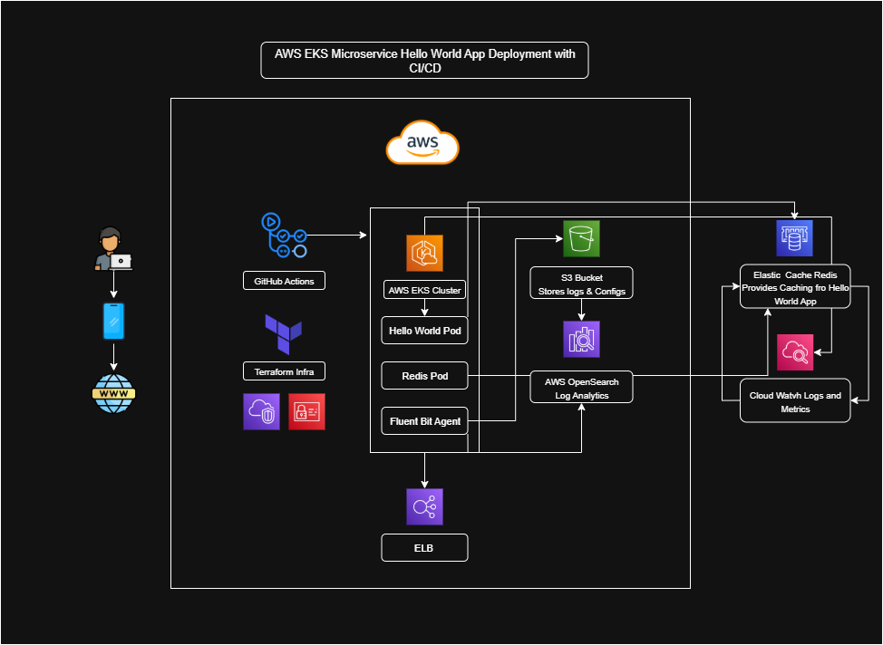

# BugRaid.AI – AWS EKS Microservices Deployment with CI/CD Pipeline (Hello World App)

This project provisions AWS infrastructure with **Terraform**, deploys a simple **Hello World app** on **Amazon EKS**, integrates **Redis (ElastiCache)** for caching, and enables **observability** with **CloudWatch** and **OpenSearch**.
CI/CD is automated via **GitHub Actions**.


## Architecture




## Tech Stack

<p align="center">
  
  
  
  
  
  
  
  
  
  
</p>


## Setup Instructions

```bash
git clone https://github.com/noufasunkesula/bugraid-assignment.git
cd bugraid-assignment

aws configure
# Use Access Key & Secret of IAM user: bugraid-noufa-admin

#terraform workflow
terraform init
terraform plan
terraform apply -auto-approve

#congig kubectl for eks
aws eks update-kubeconfig --region ap-south-1 --name bugraid-noufa-eks
kubectl get nodes

# deploy app
kubectl apply -f kubernetes-manifests/
kubectl get pods
kubectl get svc hello-world-service
```

## Screenshots
### Infrastructure

<p align="center">
  
  
</p>

### Logging & Monitoring

<p align="center">
  
  
</p>

### Kubernetes Pods & Service

<p align="center">
  

</p>

### Hello World Application

<p align="center">
  
</p>

### CI/CD Proof

<p align="center">
  
</p>

## Challenges Faced

- **OpenSearch Access Issues**
    - Initially got `anonymous user not authorized` error.
    - Solved by enabling fine-grained access control (FGAC), creating an admin user, and restricting access policy to my AWS account.
- **Terraform Module Mismatches**
    - Early versions of `terraform-aws-eks` module didn’t support `managed_node_groups`.
    - Fixed by upgrading to a newer module version and replacing old arguments with `eks_managed_node_groups`.
- **CloudWatch Logging Problems**
    - Tried using `aws_eks_cluster_logging` (deprecated resource) and got errors.
    - Fixed by using `cluster_enabled_log_types` inside the EKS module.
- **Resource Dependency Errors**
    - Terraform sometimes failed because resources weren’t created in order (VPC before EKS, etc.).
    - Solved by referencing outputs between modules (`vpc_id`, `private_subnets`).
- **Redis Confusion**
    - Initially thought Redis had to be deployed as a pod in EKS.
    - Clarified that requirement was ElastiCache Redis → integrated via Terraform, removed unused manifests.
- **Pipeline Failures in GitHub Actions**
    - First run failed due to missing AWS credentials in GitHub secrets.
    - Fixed by adding `AWS_ACCESS_KEY_ID` and `AWS_SECRET_ACCESS_KEY` under repo → Settings → Secrets.
 
## Built By

Noufa Sunkesula

Mail ID: noufasunkesula@gmail.com

Contact: +91  8106859686
